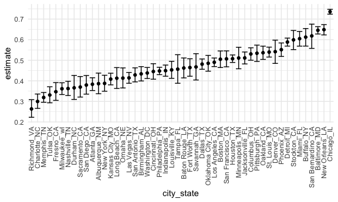

p8105\_hw5\_xw2758
================
Xinyi Wang
11/18/2020

``` r
library(tidyverse)
```

    ## ── Attaching packages ──────────────────────────────────────────────── tidyverse 1.3.0 ──

    ## ✓ ggplot2 3.3.2     ✓ purrr   0.3.4
    ## ✓ tibble  3.0.3     ✓ dplyr   1.0.2
    ## ✓ tidyr   1.1.2     ✓ stringr 1.4.0
    ## ✓ readr   1.3.1     ✓ forcats 0.5.0

    ## ── Conflicts ─────────────────────────────────────────────────── tidyverse_conflicts() ──
    ## x dplyr::filter() masks stats::filter()
    ## x dplyr::lag()    masks stats::lag()

``` r
library(rvest)
```

    ## Loading required package: xml2

    ## 
    ## Attaching package: 'rvest'

    ## The following object is masked from 'package:purrr':
    ## 
    ##     pluck

    ## The following object is masked from 'package:readr':
    ## 
    ##     guess_encoding

``` r
knitr::opts_chunk$set(
    echo = TRUE,
    fig.asp = 0.6,
    fig.width = 6,
    out.width = "90%"
)
theme_set(theme_minimal() + theme(legend.position = "bottom"))

options(
  ggplot2.continuous.colour = "viridis",
  ggplot2.continuous.fill = "viridis"
)

scale_colour_discrete = scale_colour_viridis_d
scale_fill_discrete = scale_fill_viridis_d
```

## Problem 1

``` r
homicide_df = 
  read_csv("homicide-data.csv") %>% 
  mutate(
    city_state = str_c(city, state, sep = "_"),
    resolved = case_when(
      disposition == "Closed without arrest" ~ "unsolved",
      disposition == "Open/No arrest"        ~ "unsolved",
      disposition == "Closed by arrest"      ~ "solved",
    )
  ) %>% 
  select(city_state, resolved) %>% 
  filter(city_state != "Tulsa_AL")
```

    ## Parsed with column specification:
    ## cols(
    ##   uid = col_character(),
    ##   reported_date = col_double(),
    ##   victim_last = col_character(),
    ##   victim_first = col_character(),
    ##   victim_race = col_character(),
    ##   victim_age = col_character(),
    ##   victim_sex = col_character(),
    ##   city = col_character(),
    ##   state = col_character(),
    ##   lat = col_double(),
    ##   lon = col_double(),
    ##   disposition = col_character()
    ## )

Let’s look at this a bit

``` r
aggregate_df = 
  homicide_df %>% 
  group_by(city_state) %>% 
  summarize(
    hom_total = n(),
    hom_unsolved = sum(resolved == "unsolved")
  )
```

    ## `summarise()` ungrouping output (override with `.groups` argument)

Can I do a prop test for a single city?

``` r
prop.test(
  aggregate_df %>% filter(city_state == "Baltimore_MD") %>% pull(hom_unsolved), 
  aggregate_df %>% filter(city_state == "Baltimore_MD") %>% pull(hom_total)) %>% 
  broom::tidy()
```

    ## # A tibble: 1 x 8
    ##   estimate statistic  p.value parameter conf.low conf.high method    alternative
    ##      <dbl>     <dbl>    <dbl>     <int>    <dbl>     <dbl> <chr>     <chr>      
    ## 1    0.646      239. 6.46e-54         1    0.628     0.663 1-sample… two.sided

Try to iterate ……..

``` r
results_df = 
  aggregate_df %>% 
  mutate(
    prop_tests = map2(.x = hom_unsolved, .y = hom_total, ~prop.test(x = .x, n = .y)),
    tidy_tests = map(.x = prop_tests, ~broom::tidy(.x))
  ) %>% 
  select(-prop_tests) %>% 
  unnest(tidy_tests) %>% 
  select(city_state, estimate, conf.low, conf.high)
```

``` r
results_df %>% 
  mutate(city_state = fct_reorder(city_state, estimate)) %>% 
  ggplot(aes(x = city_state, y = estimate)) +
  geom_point() + 
  geom_errorbar(aes(ymin = conf.low, ymax = conf.high)) + 
  theme(axis.text.x = element_text(angle = 90, vjust = 0.5, hjust = 1))
```



# Problem 2

**1.create a dataframe containing all file names**

``` r
filename_df = tibble( path = list.files("data/"))
```

**2.Iterate over file names and read in data for each subject**

``` r
 arm_df = filename_df %>% 
 mutate(
 path = str_c("data/", path),
 map_df(.x = path, read.csv)
 ) 
arm_df
```

    ## # A tibble: 20 x 9
    ##    path            week_1 week_2 week_3 week_4 week_5 week_6 week_7 week_8
    ##    <chr>            <dbl>  <dbl>  <dbl>  <dbl>  <dbl>  <dbl>  <dbl>  <dbl>
    ##  1 data/con_01.csv   0.2  -1.31    0.66   1.96   0.23   1.09   0.05   1.94
    ##  2 data/con_02.csv   1.13 -0.88    1.07   0.17  -0.83  -0.31   1.58   0.44
    ##  3 data/con_03.csv   1.77  3.11    2.22   3.26   3.31   0.89   1.88   1.01
    ##  4 data/con_04.csv   1.04  3.66    1.22   2.33   1.47   2.7    1.87   1.66
    ##  5 data/con_05.csv   0.47 -0.580  -0.09  -1.37  -0.32  -2.17   0.45   0.48
    ##  6 data/con_06.csv   2.37  2.5     1.59  -0.16   2.08   3.07   0.78   2.35
    ##  7 data/con_07.csv   0.03  1.21    1.13   0.64   0.49  -0.12  -0.07   0.46
    ##  8 data/con_08.csv  -0.08  1.42    0.09   0.36   1.18  -1.16   0.33  -0.44
    ##  9 data/con_09.csv   0.08  1.24    1.44   0.41   0.95   2.75   0.3    0.03
    ## 10 data/con_10.csv   2.14  1.15    2.52   3.44   4.26   0.97   2.73  -0.53
    ## 11 data/exp_01.csv   3.05  3.67    4.84   5.8    6.33   5.46   6.38   5.91
    ## 12 data/exp_02.csv  -0.84  2.63    1.64   2.58   1.24   2.32   3.11   3.78
    ## 13 data/exp_03.csv   2.15  2.08    1.82   2.84   3.36   3.61   3.37   3.74
    ## 14 data/exp_04.csv  -0.62  2.54    3.78   2.73   4.49   5.82   6      6.49
    ## 15 data/exp_05.csv   0.7   3.33    5.34   5.57   6.9    6.66   6.24   6.95
    ## 16 data/exp_06.csv   3.73  4.08    5.4    6.41   4.87   6.09   7.66   5.83
    ## 17 data/exp_07.csv   1.18  2.35    1.23   1.17   2.02   1.61   3.13   4.88
    ## 18 data/exp_08.csv   1.37  1.43    1.84   3.6    3.8    4.72   4.68   5.7 
    ## 19 data/exp_09.csv  -0.4   1.08    2.66   2.7    2.8    2.64   3.51   3.27
    ## 20 data/exp_10.csv   1.09  2.8     2.8    4.3    2.25   6.57   6.09   4.64

**3.Tidy the result**

``` r
arm_df_tidy = 
  arm_df %>%
  mutate(
    path = str_remove_all(path,".csv"),
    path = str_remove_all(path, "data/")
  ) %>%
  separate(path, into = c("arm","id"), sep = 3) %>%
  mutate(
    id = str_remove_all(id, "_"),
    arm = str_replace(arm,"con","control"),
    arm = str_replace(arm,"exp","experiment")
  ) %>% 
 pivot_longer(
  week_1:week_8,
  names_prefix = "week_",
  names_to = "week",
  values_to = "value"
 )
arm_df_tidy
```

    ## # A tibble: 160 x 4
    ##    arm     id    week  value
    ##    <chr>   <chr> <chr> <dbl>
    ##  1 control 01    1      0.2 
    ##  2 control 01    2     -1.31
    ##  3 control 01    3      0.66
    ##  4 control 01    4      1.96
    ##  5 control 01    5      0.23
    ##  6 control 01    6      1.09
    ##  7 control 01    7      0.05
    ##  8 control 01    8      1.94
    ##  9 control 02    1      1.13
    ## 10 control 02    2     -0.88
    ## # … with 150 more rows

**4.Make a spaghetti plot**

``` r
arm_df_tidy %>% unite("arm_id",c(arm,id), sep = "_", remove = F) %>%
  ggplot(aes(x = week,y = value)) +
  geom_point(aes(color = arm,group = id)) +
  geom_path(aes(colour = arm,group = arm_id),alpha = .5)
```


Comment: At first, two group are similar and experimental group has
larger standard deviation. With time by, control group is stable, while
the value of experiment group increases.

# Problem 3
